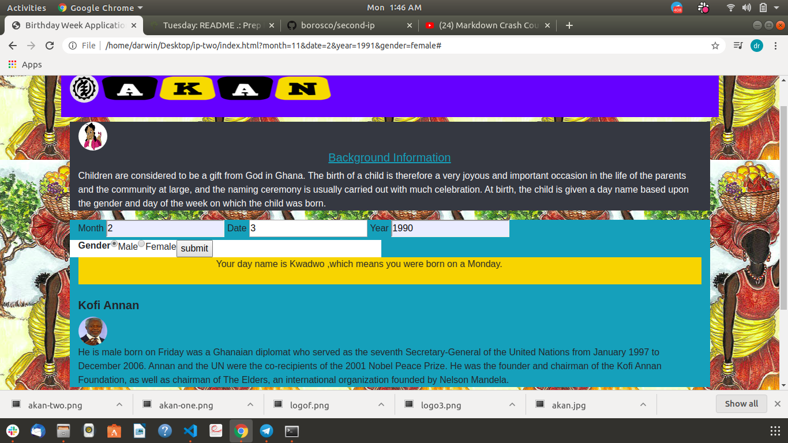

# APPLICATION NAME:AKAN NAMES WEB APPLICATION
## NAME OF CONTRIBUTORS: DARWIN ONKOBA BORORIO
## DESCRIPRION OF THE PROJECT PURPOSE
>THIS APPLICATION COLLECTS THE USER DATE YEAR AND MONTH AND ASSIGNS THEM AN AFRICAN NAME AS PER THE DAY OF THE WEEK THEY WERE BORN FROM MONDAY TO SUNDAY DEPENDING ON THE ALGORITHIM WE GENERATED.
## INSTALLATION INSTRUCTIONS
Our web application will be hosted live on the gh pages for the end user to interact with on the git hub all the files used in the development will be available on for any installation it can be cloned from git hub.
## DEMONSTRATION 

> The user is born on the 2nd month of date 3 in the year 1990.
>Outputs the name Kwadwo for male gender which means he was born on a monday.

